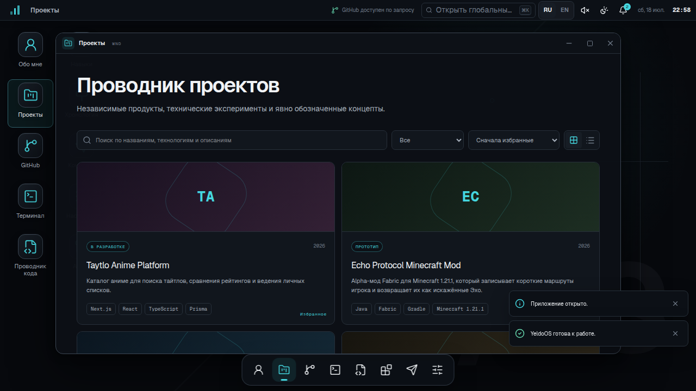
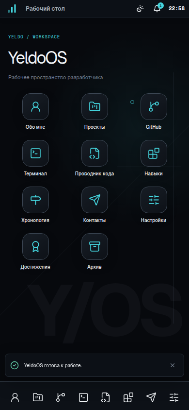

# YeldoOS

YeldoOS is an interactive developer portfolio presented as an original operating system inside the browser. It belongs to Yeldo, a frontend developer in Almaty, Kazakhstan, and turns projects, public GitHub activity, profile content, skills, contact details, and a virtual filesystem into focused desktop applications.

This is a functional portfolio, not a static interface mockup. The window manager, terminal parser, GitHub route, settings, search, localization, notifications, and achievements all run in the application.

## Screenshots

| Desktop                                                     | Mobile workspace                                          |
| ----------------------------------------------------------- | --------------------------------------------------------- |
|  |  |

## Features

- 1–2 second localized boot sequence with skip and reduced-motion behavior.
- Original desktop with status bar, shortcuts, dock, notifications, clock, themes, and responsive wallpaper system.
- Movable and resizable desktop windows with focus, z-index, viewport bounds, minimize, maximize, restore, and close controls.
- Tablet window mode with simplified resizing and a purpose-built mobile launcher with full-screen app panels.
- About, Projects, GitHub, Terminal, Code Explorer, Skills, Timeline, Contact, Settings, Achievements, and Archive applications.
- Project explorer with grid/list views, status filters, sorting, technology search, honest release states, and detailed case studies.
- Live public GitHub profile, repository, event, language, and commit data from the official REST API.
- Server-side GitHub token handling, Zod validation, response caching, timeouts, rate-limit feedback, and non-fabricated fallback data.
- Simulated terminal with history, Arrow navigation, Tab completion, localized output, virtual files, application launch commands, and safe Easter eggs.
- Read-only virtual portfolio tree with tabs, breadcrumbs, Markdown rendering, JSON highlighting, line numbers, copy, and keyboard navigation.
- Fuzzy command palette and global search across apps, projects, skills, virtual files, timeline entries, commands, and contacts.
- Complete Russian (default) and English interfaces through `next-intl`.
- Persisted Graphite, OLED, Midnight, and Minimal Light themes, accents, wallpapers, scale, motion, sound, boot, clock, language, and simplified navigation settings.
- Local, non-manipulative achievements and dismissible screen-reader announcements.
- Localized metadata, canonical and alternate URLs, sitemap, robots, generated Open Graph image, structured data, and installable manifest.
- Conservative service worker that caches only a navigation fallback and never caches API responses.

## Technology

- Next.js 16 App Router and React 19
- TypeScript strict mode
- Tailwind CSS 4 plus a purpose-built CSS system
- Framer Motion
- Zustand persistence middleware
- `next-intl`
- Lucide React
- Recharts
- React Markdown
- React RND
- Fuse.js
- Zod
- Vitest
- ESLint and Prettier

## Requirements

- Node.js 20.9 or newer
- npm 10 or newer

## Installation

```bash
git clone https://github.com/TheYeldo/yeldo-os.git
cd yeldo-os
cp .env.example .env.local
npm install
npm run dev
```

Open [http://localhost:3000](http://localhost:3000). The root route redirects to Russian at `/ru`; English is at `/en`.

YeldoOS works without environment variables. A GitHub token is optional.

## Environment variables

```bash
# Optional server-only GitHub token. Never use a NEXT_PUBLIC_ prefix.
GITHUB_TOKEN=

# Canonical deployment URL used by metadata, robots, and sitemap.
NEXT_PUBLIC_SITE_URL=https://yeldo-os.vercel.app
```

Use a fine-grained GitHub token with the minimum public repository read permission required. The token is read only in `src/app/api/github/route.ts` and is never returned to the browser.

## Development commands

```bash
npm run dev          # Start the Turbopack development server
npm run lint         # ESLint with zero warnings
npm run typecheck    # Strict TypeScript check
npm test             # Unit tests
npm run build        # Optimized production build
npm run start        # Serve the production build
npm run format       # Write Prettier formatting
npm run format:check # Verify formatting
```

## Architecture

```text
src/
├── app/
│   ├── [locale]/            # Localized static portfolio route
│   └── api/github/          # Validated, cached GitHub Route Handler
├── components/
│   ├── apps/                # Isolated portfolio and developer apps
│   ├── command-palette/     # Fuzzy global navigation and actions
│   ├── desktop/             # Shell, launcher, status bar, shortcuts, dock
│   ├── notifications/       # Toasts, center, achievement feedback
│   ├── ui/                  # Boot, locale, logo, PWA registration
│   └── windows/             # Window frame, layer, dynamic app renderer
├── config/                  # Profile and visual theme configuration
├── data/                    # Apps, projects, skills, timeline, files, commands
├── hooks/                   # Responsive and clock hooks
├── i18n/                    # Routing, request config, typed navigation
├── lib/                     # GitHub schemas and terminal parser
├── messages/                # Complete ru/en translation catalogs
├── store/                   # Persisted system and window state
├── types/                   # Shared strict domain types
└── utils/                   # Clipboard and safe storage helpers
```

The localized page is statically generated. The interactive OS is a client boundary beneath it, while GitHub network access stays in a Route Handler. Heavy applications are dynamically imported. Persisted user preferences are kept separate from short-lived boot, dialog, and notification state.

## Localization

Russian is the default locale. Routing lives in `src/i18n/routing.ts`; message catalogs are `src/messages/ru.json` and `src/messages/en.json`.

To add a locale:

1. Add the locale to `routing.locales`.
2. Copy an existing message catalog and translate every key.
3. Extend `src/types/system.ts` and the language controls where appropriate.
4. Verify the boot screen, status bar, window titles, applications, terminal output, errors, metadata, and mobile layouts.

Commands, filenames, package names, and source syntax intentionally remain in English.

## GitHub API configuration

`GET /api/github` requests only public data for `TheYeldo`:

- profile;
- recently updated public repositories;
- recent public events;
- recent commits for a bounded set of non-fork repositories.

Requests use a seven-second timeout and a 30-minute shared cache. Manual refresh bypasses the response cache but is rate-limited in the UI. External payloads are parsed with Zod before normalization. If GitHub is unavailable, the route returns only known profile identity and links; stars, forks, repository counts, events, commits, and contribution totals are not invented.

## Customize the profile

Edit `src/config/profile.ts` for name, role, location, GitHub, Telegram, email, resume, availability, education, and social links. Missing personal facts intentionally remain `null`.

Update longer biography and interface copy in both locale catalogs. The corresponding read-only portfolio files live in `src/data/virtual-files.ts`.

## Add a project

Add a typed `Project` entry to `src/data/projects.ts`. Every project supports:

- slug, status, and optional year;
- localized description and full case study;
- role, challenge, solution, and lessons;
- technologies, screenshots, and optional video;
- nullable repository and live URLs;
- featured state.

Use `null` when a URL or year is unavailable. Do not use placeholder external URLs.

## Add an application

1. Add the identifier to `appIds` in `src/types/system.ts`.
2. Add its size, icon, and launcher flags in `src/data/apps.ts`.
3. Create the isolated component in `src/components/apps/`.
4. Add a dynamic import in `src/components/windows/app-renderer.tsx`.
5. Add complete application name and description keys to both message catalogs.
6. Verify desktop windows, tablet constraints, mobile full screen, focus order, and command-palette discovery.

## Add a terminal command

1. Add the command to `src/data/terminal-commands.ts` for help and completion.
2. Implement its safe behavior in `src/lib/terminal.ts`.
3. Add every output key to both message catalogs.
4. Add parser coverage in `tests/terminal.test.ts`.

The terminal must remain a simulation. It must never execute visitor input as a real shell command.

## Add an achievement

Add a definition in `src/data/achievements.ts`, add localized title and description keys, and call `unlockAchievement` or the relevant store action. Achievements are local exploration markers and should not introduce streaks, urgency, or misleading progress.

## Deployment

### Vercel CLI

```bash
npm run lint
npm run typecheck
npm test
npm run build
npx vercel link
npx vercel env add GITHUB_TOKEN production # optional
npx vercel --prod
```

Set `NEXT_PUBLIC_SITE_URL` to the final production URL in every environment where canonical metadata matters. Git integration can deploy the `main` branch automatically after the repository is connected.

### Other Node hosts

```bash
npm ci
npm run build
npm run start
```

The server route requires outbound HTTPS access to `api.github.com`.

## Verification

Automated tests cover terminal parsing, window state transitions, and external GitHub schema normalization/fallback behavior. Release verification additionally checks both locales, common desktop interactions, mobile and tablet layouts, command-palette keyboard navigation, live/fallback GitHub content, reduced motion, persisted settings, console errors, and the production build.

## Known limitations

- Email, education, availability, resume, and project media remain explicit placeholders until verified content is supplied.
- GitHub pinned repositories and a reliable lifetime contribution total are not available from the unauthenticated REST endpoints used here, so neither is fabricated.
- The contact app uses real direct links and copy actions; it does not ship a non-functional form.
- The service worker provides a small offline navigation fallback. It is not a full offline mirror and deliberately avoids aggressive asset/API caching.
- Each application has one window instance. Multiple different applications can be open concurrently, but duplicate windows for the same app are intentionally focused instead.
- Browser windows cannot integrate with native multi-monitor, filesystem, or operating-system APIs.

## Roadmap

- Add verified education, availability, email, and resume content.
- Add licensed screenshots and optional video for project case studies.
- Add production E2E tests to CI across Chromium and mobile emulation.
- Add optional GitHub GraphQL pinned-repository support when a server token is configured.
- Add import/export for local YeldoOS settings.

## License

MIT. See [LICENSE](LICENSE).
